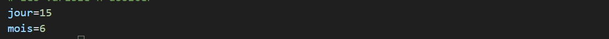
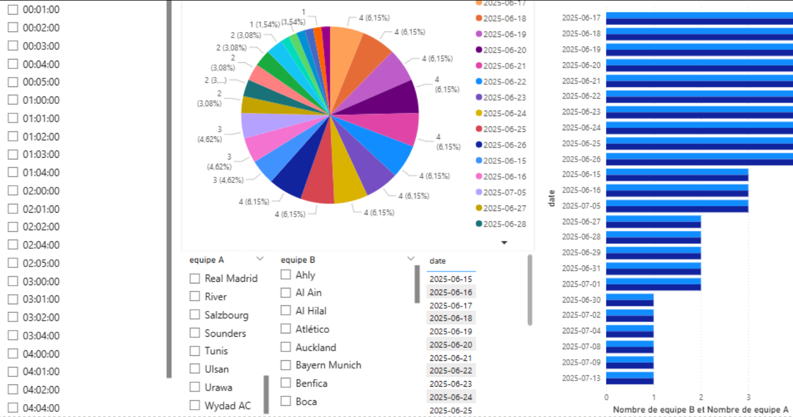
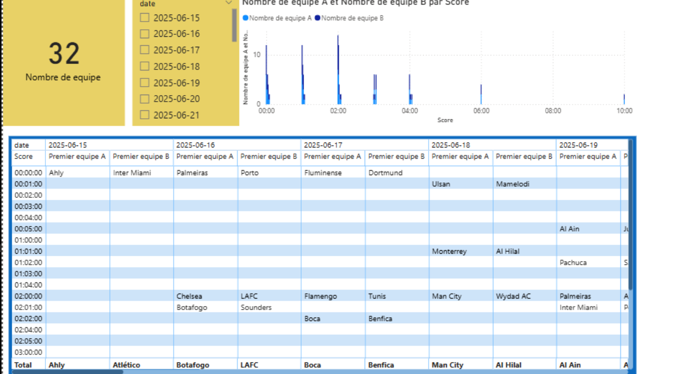
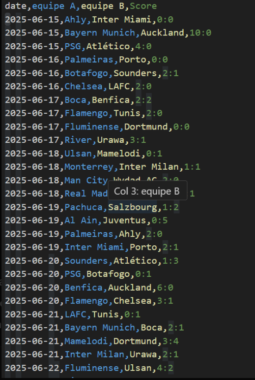

# web scraping.
Dans ce projet, on réalise un script en **Python** qui permet de **scraper les données des matchs (score, date,...) de la Coupe du Monde des clubs**.  
L’objectif est de **faciliter l’accès aux données** afin de pouvoir les **analyser** plus facilement.

---

## 🚀 Objectif du projet
- Comprendre les bases du web scraping
- Préparer les données pour une future analyse
- Extraire les informations des matchs et des joueurs

---

## 🛠️ Technologies utilisées
- **Python 3**
- **Requests** → pour récupérer les pages web.
- **BeautifulSoup4** → pour analyser le HTML et extraire les données.
- (optionnel) **Pandas** → pour organiser les données dans des tableaux.

---

## 📂 Structure du projet
┣ 📜 scripte.py → fichier principal 
┣ 📜 data.csv → fichier principal 

----

## Comment on peux l'utiliser 
1. Choisir l’année de la compétition (ex : en notre cas 2025) 
2. Changer le jour et le mois de début de la compétition (ex : jour=15, mois=6) 

----

## résultats en Power BI



   
## ▶️ Exemple d’exécution
```bash
  python scraper.py 
ou run en vs code
